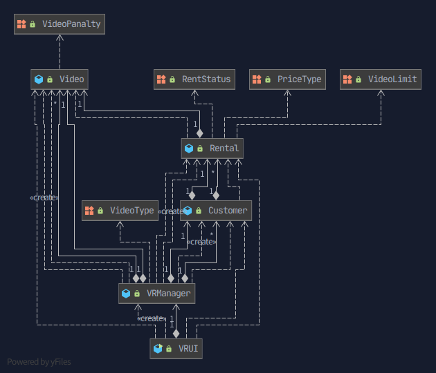

# Refactoring Exercise

## before class diagram

1. VRUI.java에서 Customer 찾는 부분을 함수로 분리
2. VRUI.java에서 UI는 그대로 두고 로직 관련된 부분을 VRManager.java로 분리
3. Customer 내의 Long Method 분리
4. 의미 있는 상수 변수화 
5. Primitive Obsession 해소 했고요
6. 데드코드 삭제

## after class diagram

